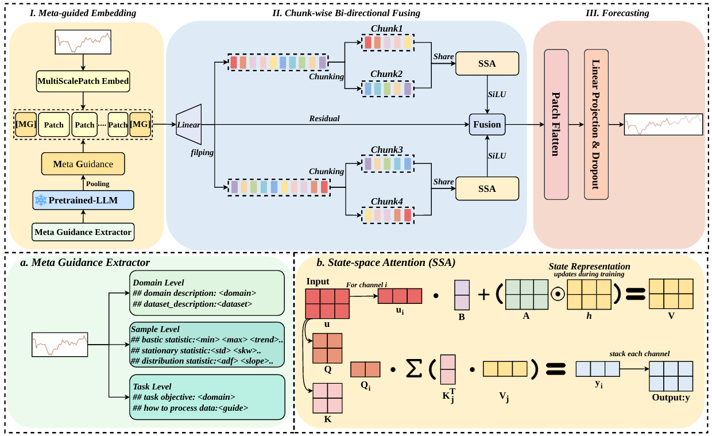

<h1 align="center">
SLAN: State-space Linear Attention Network with Meta Guidance and
Chunk-wise Fusion for Long-term Time Series Forecasting
</h1>


<br>

<div align="center">
  
</div>


<br>


## :tada:Usage
### :wrench:Setup

The required dependencies for this project are listed in `requirements.txt`. You can install them using pip with the following command:

```bash
pip install -r requirements.txt
```

(*Optional*) If you still encounter the package missing problem, you can refer to the [`requirements.txt`](./requirements.txt) file to download the packages you need. 

**If you encounter other environment setting problems not mentioned in this README file, please contact us to report your problems or open an issue.**

### :fire:Quick Demos
You can use the following instruction in the root path of this repository to run the training process:
```bash
bash scripts/SLAN.sh
```

If you want to customize the training, you can modify the parameters in [`scripts/SLAN.sh`](./scripts/SLAN.sh) to adjust batch size, learning rate, mask rates, or other hyperparameters.


